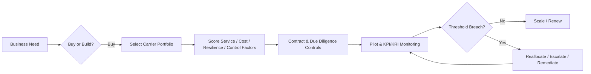

# Temu Logistics: Commercial Operations, Vendor Selection & Third-Party Risk

> **Portfolio case study | Columbia University academic work reconstructed for recruiting use**

## 30-Second View

**Decision:** Conditionally outsource logistics through a diversified two-layer carrier portfolio rather than build a proprietary U.S. network.

**Operating model:**  
- Cross-border line-haul: **J&T Express / YunExpress**
- U.S. last-mile: **UPS / USPS**
- Concentration control: **no single carrier >40% without senior risk acceptance**

**What I built / owned:** TPRM risk & control analysis, confidential-data governance, public-source research for those sections, cross-workstream integration, most of the final presentation build, and the final management synthesis. I also independently built a separate third-party risk-rating dashboard.

**Why this matters for analyst roles:** the project connects business strategy, vendor selection, operational KPIs, exception handling, risk controls, and management action.

## Decision Flow

## Key Results

| Analysis | Result | Management Meaning |
|---|---|---|
| Buy vs. Build | **Conditional BUY** | Faster market access, lower fixed-capital exposure, specialist logistics capability |
| Cross-border group score | **3.9 / 5** | Clears 3.5 selection threshold |
| U.S. last-mile group score | **4.3 / 5** | Strong fit for domestic coverage / reliability |
| Independent vendor-risk model | **1.90 / 3 — Medium** | Conditional approval + remediation |
| Highest modeled risk | **Subcontractor reliance: 2.50 / 3** | Requires stronger fourth-party visibility and controls |
| Concentration control | **40% carrier cap** | Prevents uncontrolled dependency and supports reallocation |

## Portfolio Artifacts

| Artifact | What it Shows |
|---|---|
| [Vendor Selection Scorecard](vendor_selection_scorecard.csv) | Weighted decision logic across eight criteria |
| [Third-Party Risk Rating Dashboard Data](risk_rating_dashboard.csv) | Category weights, risk scores, risk levels, management actions |
| [Controls & Monitoring Framework](controls_monitoring_framework.md) | Controls, KRIs, escalation logic, governance cadence |
| [Illustrative Allocation Scenario](illustrative_allocation_scenario.md) | How KPI deterioration can drive reallocation and escalation |
| [Allocation Scenario Data](illustrative_allocation_scenario.csv) | Before/after allocation under a 40% concentration constraint |
| [Weighted Scoring Python Demo](analysis/weighted_scoring.py) | Transparent reproduction of the scoring logic in basic Python |
| [Methodology](methodology.md) | Scoring formulas, thresholds, decision rules |
| [Assumptions & Limitations](assumptions_and_limitations.md) | What is academic, reconstructed, synthetic, or source-dependent |

---

## 1. Business Problem

Temu's asset-light model creates a strategic trade-off.

**BUILD** would mean owning logistics infrastructure, fleets, facilities, systems, staffing, and the associated operating complexity.

**BUY** would leverage established logistics providers for faster market access, variable-cost capacity, and specialist expertise — while creating third-party execution, concentration, data, compliance, and subcontractor risk.

The objective is therefore not to eliminate risk. It is to select the operating model with the best strategic fit and make the residual risk measurable, controllable, and governable.

## 2. Buy vs. Build

The BUY case is stronger on:
- capital discipline
- speed to market
- flexibility during promotions and demand spikes
- access to logistics and customs expertise
- management focus on core marketplace capabilities

The BUILD case offers more direct control, but requires significant fixed investment and exposes the company to asset-utilization, labor, safety, insurance, technology, and transportation complexity.

**Recommendation:** BUY, but only with defined due diligence, contractual controls, risk acceptance, and ongoing monitoring.

## 3. Vendor Selection

The academic case used eight weighted criteria and a **3.5 / 5 selection threshold**.

| Criterion | Weight | Cross-Border Group | U.S. Last-Mile Group |
|---|---:|---:|---:|
| Cross-border capability | 15% | 5 | 2 |
| U.S. last-mile coverage | 15% | 2 | 5 |
| Cost efficiency | 15% | 5 | 4 |
| Delivery reliability | 15% | 4 | 5 |
| Data security | 10% | 4 | 5 |
| Compliance capability | 10% | 4 | 5 |
| Subcontractor oversight | 10% | 3 | 4 |
| Resilience | 10% | 4 | 5 |
| **Weighted total** | **100%** | **3.9** | **4.3** |

The two-layer structure assigns providers to the lane where they are strongest instead of forcing one carrier to do everything.

## 4. Independent Third-Party Risk Rating Model

As a separate **individual assignment**, I built a structured third-party risk rating dashboard using:
- a 1–3 risk scale
- risk-based category weights
- 20 due-diligence questions
- evidence / notes fields
- weighted scoring
- management-action mapping

**Overall weighted score:** **1.90 / 3.00 — Medium Risk**  
**Management action:** **Conditional approval + remediation plan**

The highest-risk category was **Reliance on Subcontractors (2.50 / 3 — High)**, which reinforces the need for:
- fourth-party inventory
- approval rights
- contractual flow-down
- auditability
- incident reporting
- remediation before scale-up

## 5. Controls & Monitoring

The control framework focuses on risks that can directly affect customer experience, continuity, data protection, and regulatory exposure.

- **Operational / service:** on-time delivery SLAs, loss/damage thresholds, peak-capacity commitments, route contingency, backup-carrier readiness.
- **Data privacy & confidentiality:** data minimization, DPA, encryption, role-based access, logging, no secondary use, deletion / return, 24-hour incident notification.
- **Regulatory / customs:** compliance attestations, documentation standards, audit rights, regulatory-change notification.
- **Concentration:** no single carrier above 40% of parcel volume without senior risk acceptance.
- **Fourth-party / subcontractor:** inventory, approval rights, contractual flow-down, audit rights, incident reporting.
- **Ongoing monitoring:** monthly KPI / KRI review, issue escalation, annual reassessment, renew / remediate / replace decisions.

## 6. Illustrative Allocation & Exception Handling

To connect the risk framework to day-to-day operations, I added a **synthetic portfolio scenario**.

A planning batch of 1,000 last-mile shipments is allocated across UPS, USPS, and a pre-qualified backup carrier while respecting the 40% concentration threshold.

When an on-time-delivery KPI deteriorates:
1. detect the threshold breach,
2. validate the signal,
3. stop increasing exposure,
4. reallocate volume within concentration limits,
5. open an issue with an owner and remediation date,
6. restore volume only after acceptable performance evidence.

This turns a control statement into an operating rule:

**KPI deterioration → allocation change → escalation → remediation → controlled restoration**

## 7. Implementation Roadmap

**Phase 1 — Validate & Pilot**
- complete due diligence
- negotiate SLAs, data, audit, subcontractor, and incident controls
- pilot selected logistics lanes
- validate delivery performance and customer experience

**Phase 2 — Scale & Diversify**
- increase volume gradually
- maintain multi-carrier routing
- enforce concentration thresholds
- validate peak-season capacity

**Phase 3 — Optimize & Govern**
- continuous KPI / KRI monitoring
- periodic vendor reviews
- annual risk reassessment
- remediation, renewal, or replacement decisions

## My Contribution & Project Provenance

The original Temu case was developed as a **six-person Columbia University team project**.

My primary contribution was:
- owning the TPRM risk & control assessment
- owning the confidential-data handling and governance analysis
- conducting public-source research supporting those sections
- coordinating and integrating team workstreams
- designing and building most of the final presentation
- synthesizing the final management recommendation

I also completed the companion third-party risk-rating dashboard as an **independent individual assignment**.

The course explicitly permitted and expected AI-assisted work. AI was used as a support tool; final source selection, risk judgment, framework integration, presentation design, and management conclusions were reviewed and owned by me.

## Skills Demonstrated

**Operations & Analytics**
- structured decision analysis
- weighted scoring
- KPI / KRI design
- vendor performance monitoring
- allocation / exception logic
- operating-model evaluation
- implementation planning

**Risk & Controls**
- third-party risk management
- due diligence
- control design
- concentration risk
- fourth-party risk
- confidential-data governance
- issue escalation
- residual-risk acceptance

**Tools**
- Excel / spreadsheet modeling
- Power Query, PivotTables, XLOOKUP / VLOOKUP, IF / SUMIFS
- PowerPoint
- Python (coursework)
- Java (coursework)
- R (coursework)

## Reproducibility

The Python file under `analysis/` reproduces the weighted-selection scores and the independent risk-rating result using transparent inputs and standard-library Python only.

This is intentionally simple: the purpose is auditability and interview explainability, not to present the project as a software-engineering exercise.

## Sources & Scope

The academic case used course materials and public sources including:
- PDD Holdings public filings
- UPS public materials
- USPS public materials
- 2023 Interagency Guidance on Third-Party Relationships
- other public academic / regulatory references used in the course work

This repository is an **independent portfolio reconstruction** of academic work. It does not publish teammates' personal information or represent team contributions as solely mine.

Some classroom business-value figures are intentionally omitted because they require source-level validation before being presented as decision-grade facts.

This case is for analytical demonstration and does not claim access to Temu's internal vendor contracts, actual carrier allocation, or control environment.
